# Petstagram

## Índice

* [1. Resumen del proyecto](#1-resumen-del-proyecto)
* [2. Historias de usuario](#2-historias-de-usuario)
* [3. Prototipo](#3-prototipo)
* [4. Test de usabilidad](#4-test-de-usabilidad)
* [5. Producto final](#5-producto-final)

## 1. Resumen del proyecto
Nos ha pasado que vemos perfiles de mascotas en distintas redes sociales, entonces desde este punto de vista nace Petstagram, una red social orientada netamente a la interacción de mascotas a través de sus dueños.

## 2. Historias de usuario

Este proyecto se dividió básicamente en dos historias que veremos en las siguientes imágenes:
### Historia 01
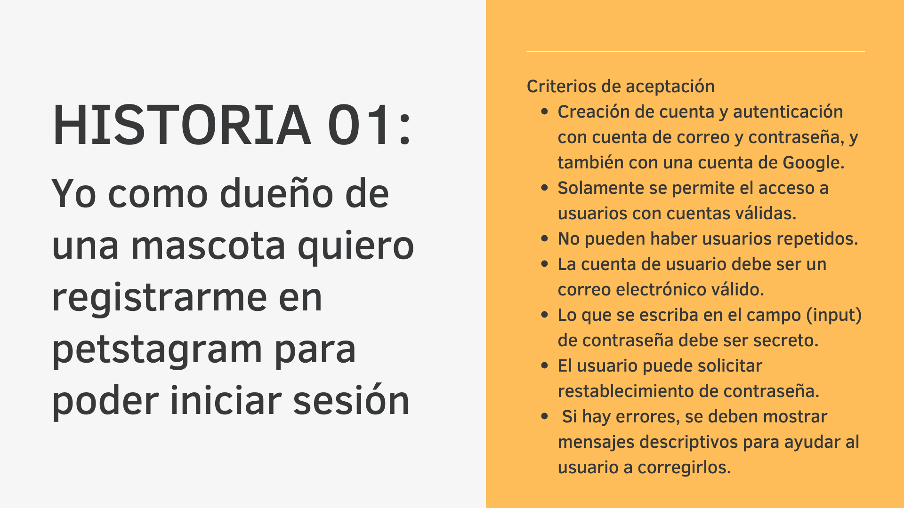
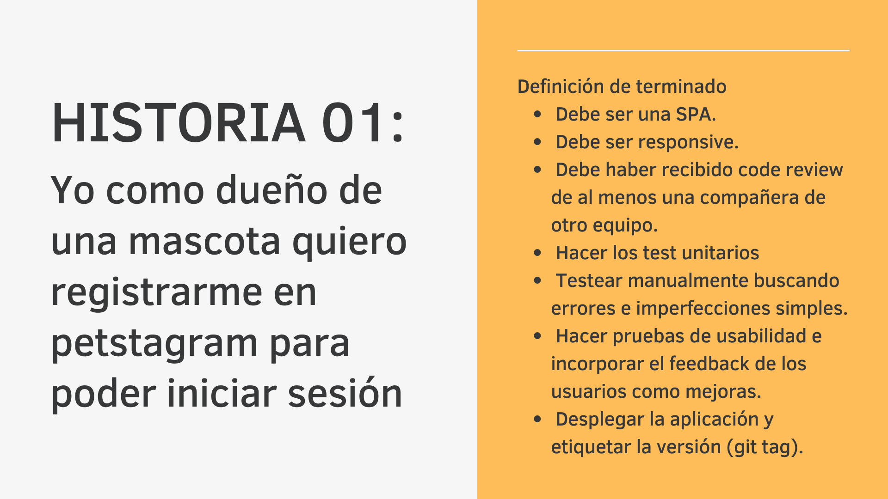
### Historia 02
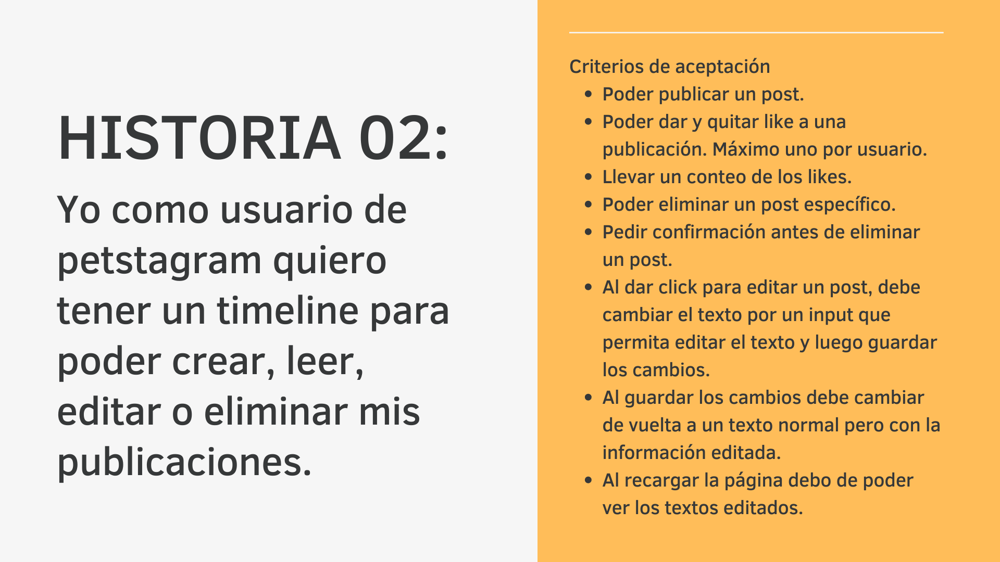
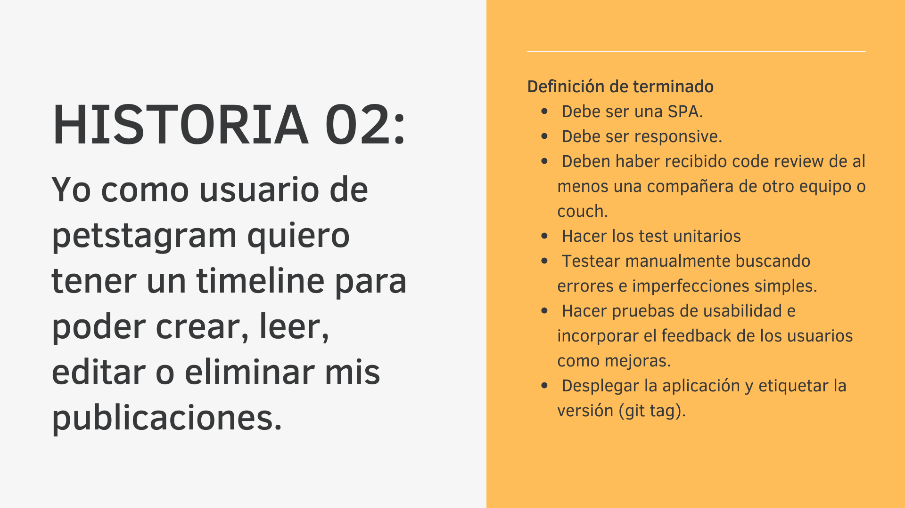

## 3. Prototipo
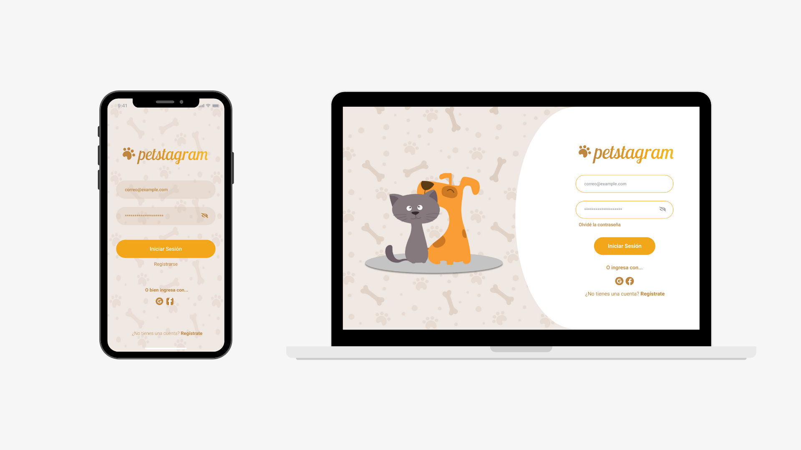
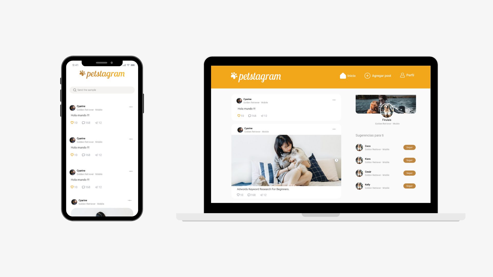
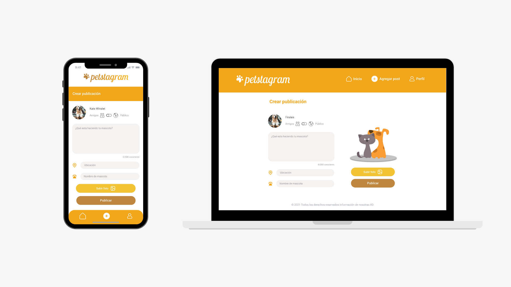
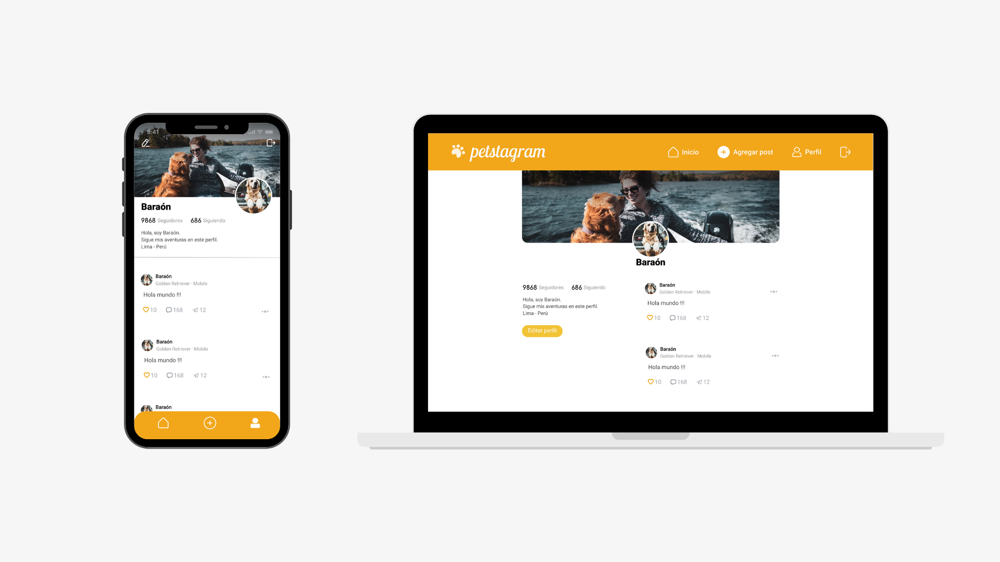
## 4. Test de usabilidad

* ### Antes de producción
  Los cuatro usuarios indicaron que el diseño era amigable y los colores estaban bien definidos.

* ### Durante producción
  A los usuarios se les hizo fácil crearse sus cuentas, como feedback recibimos agregar el nombre de las en una sección diferente.

  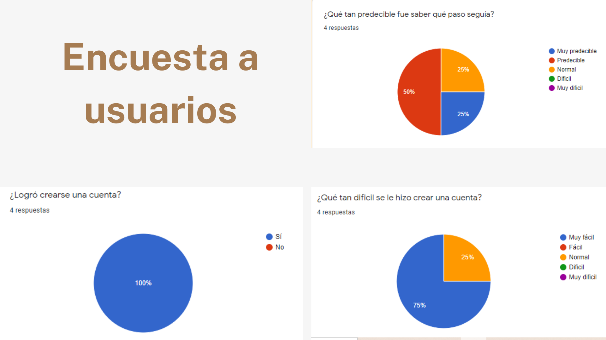
* ### Encuesta con producto finalizado
  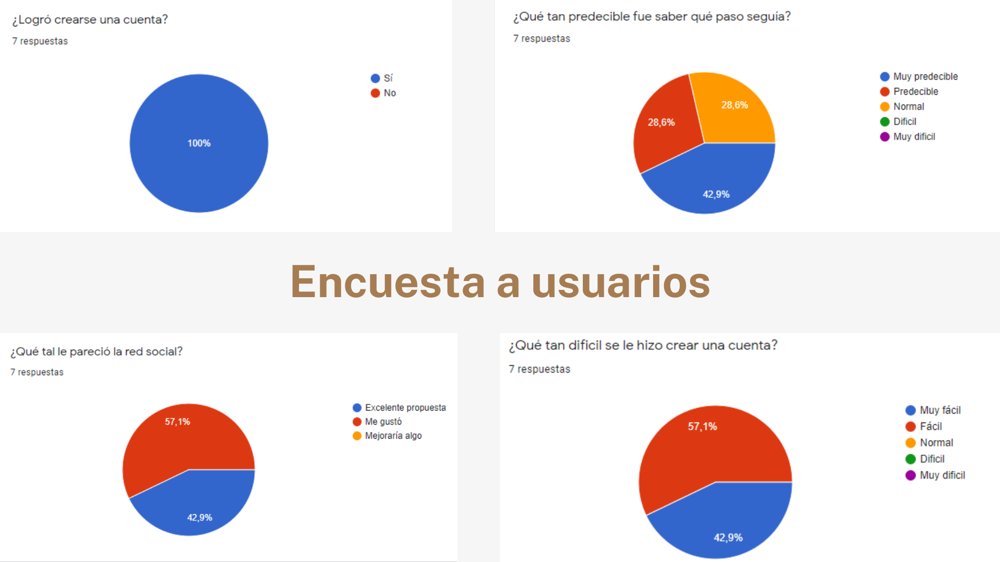

* ### Final

  Los usuarios tuvieron que realizar las siguientes tareas:

  - Crear una cuenta con correo y/o gmail desde un inicio
  - Iniciar sesión con la cuenta creada
  - Ver los posts en home
  - Ver perfil y editar los datos del perfil
  - Crear post, editar y eliminar

  A continuación detallamos el feedback y cómo lo solucionamos :
   
  - No redirigía a home cuando se autenticaba con google, para ello agregamos una función que faltaba.
  - El texto de un modal se movió, lo arreglamos modificando los estilos css.
  - Cambiamos una descripción de botón de "Editar a perfil" a "Guardar datos".

## 5. Producto final

### Versión mobile
* #### Home
  

* #### Crear post
  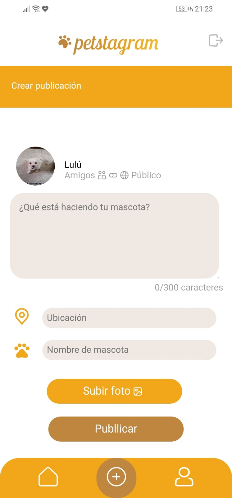

* #### Perfil
  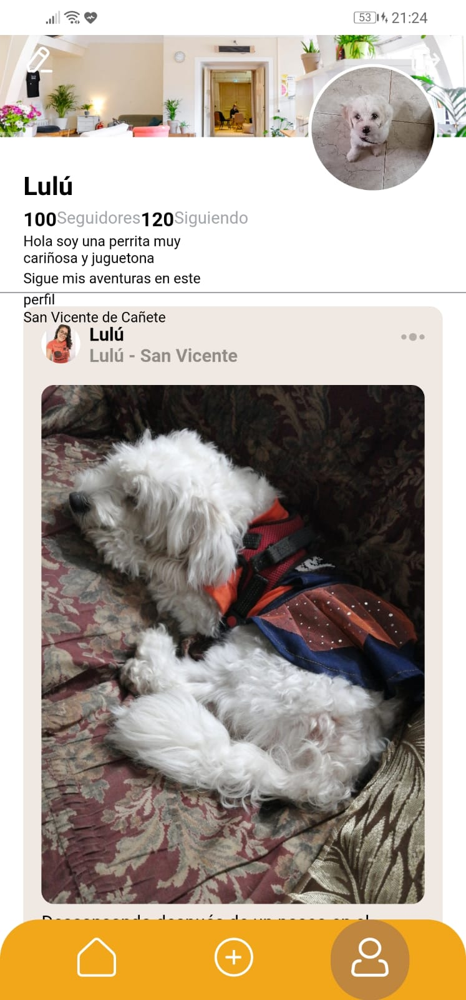

* #### Editar perfil
  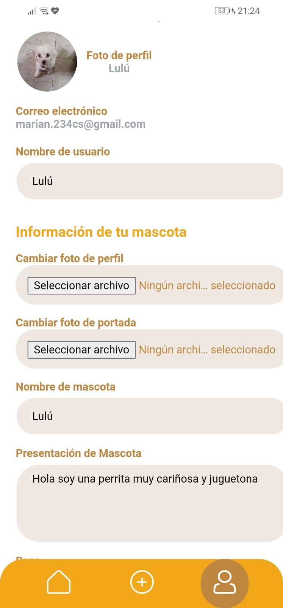

### Versión desktop
* #### Home
  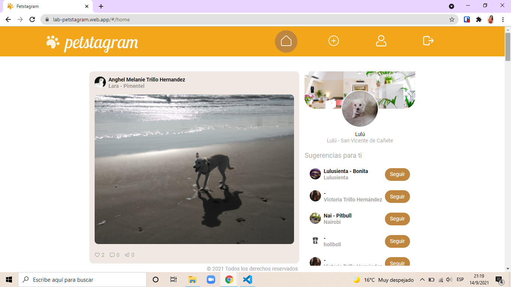

* #### Crear post
  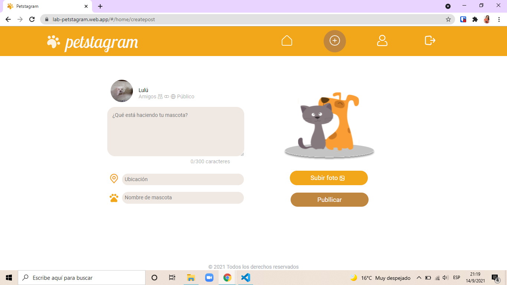

* #### Perfil
  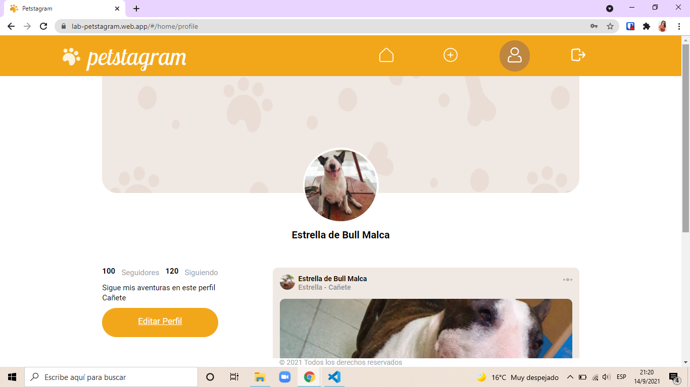

* #### Perfil
  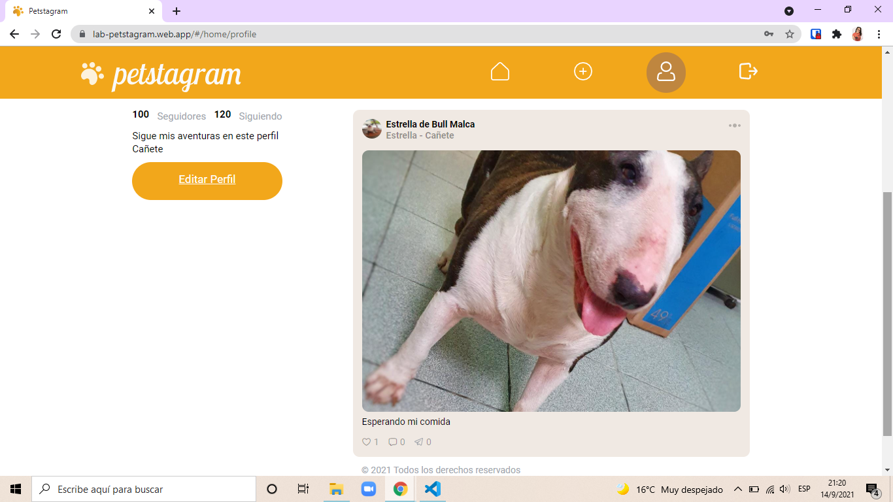

* [Link petstagram](https://lab-petstagram.web.app/)
* [Link petstagram](https://lab-petstagram.firebaseapp.com/)
